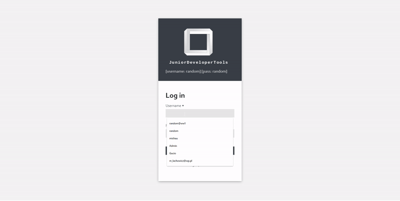
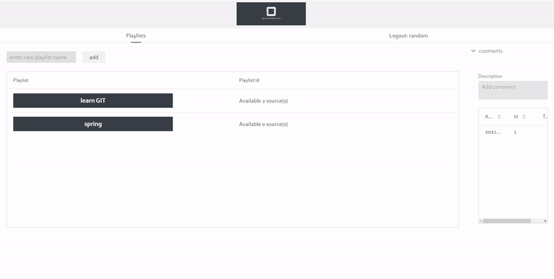
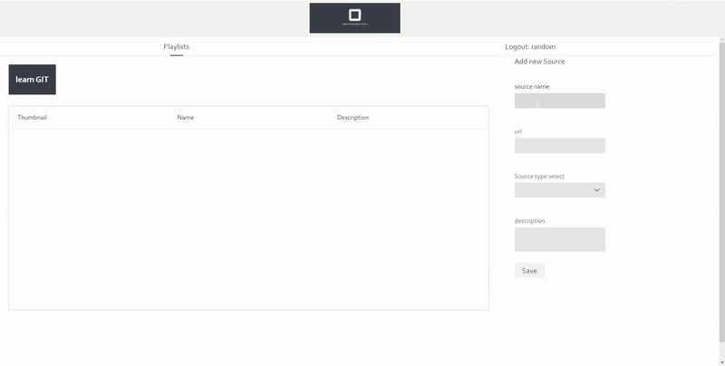
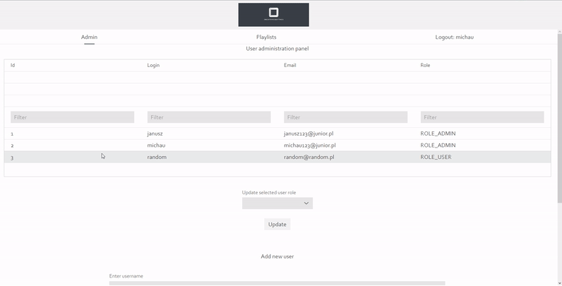

# Junior Developer Tools

 ##### Get Yours all tutorials in one place.
This app helps the user to store his tutorials both
video and website writeups assigned to the specific subject they concern.
In simple words user can create specific playlist, or bookmark and paste there links to 
his favorite and most valuable tutorials concerning this specific subject.

---
### Used technologies
- for backend part java and spring 
- UI part done with Vaadin 
- MySQL and H2 database support 

---
### Basic functions:
  

###### Login panel
For development there are a three default users embedded in a start. Admin can also add new users via admin panel.

  
###### Main view
User can add new playlists here, place some comments and navigate between subjects. Also, logout option is available

  
  
  
  
###### Add new source
User can add new sources by pasting links. Thumbnail is automatically generated.

  
  
  

  

###### Admin panel
Admin panel allows adding new users and change user's privileges.

  
---
### Authors:  

[ stolarri](https://github.com/stolarri)  
  
    
    
[ apokalipsa44](https://github.com/apokalipsa44)  

